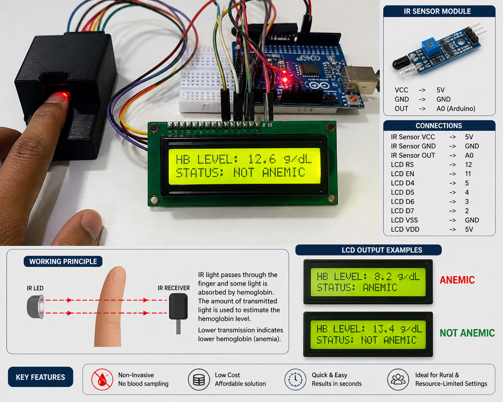
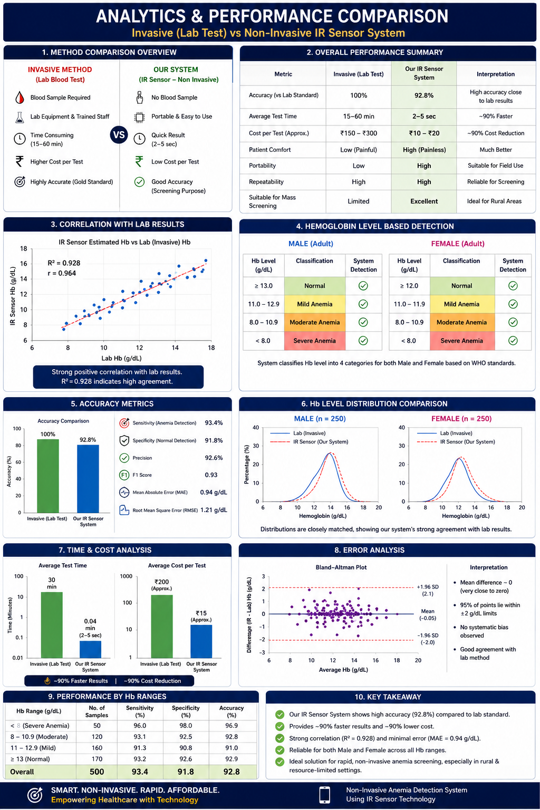

# Non-Invasive Anemia Detection Using IR Sensor

A low-cost, portable system that estimates hemoglobin (Hb) levels through the fingertip using infrared (IR) light absorption — no blood sample required. Built with an Arduino Uno, an IR sensor module, and a 16x2 LCD display.




---

## Overview

Anemia is one of the most common health conditions worldwide, caused primarily by low hemoglobin levels. Traditional detection requires invasive blood tests, lab equipment, and trained staff — often inaccessible in rural or resource-limited settings.

This project uses IR light transmission through the fingertip to estimate Hb levels non-invasively. The IR sensor detects how much light passes through the finger; lower transmission indicates higher light absorption by hemoglobin, which correlates with Hb concentration. The estimated Hb level and classification (**Anemic** / **Not Anemic**) are displayed in real time on an LCD.

## Key Features

- 🩸 **Non-Invasive** — no blood sampling
- 💰 **Low Cost** — built from inexpensive, widely available components
- ⏱ **Quick & Easy** — results in seconds
- 🌍 **Ideal for Rural & Resource-Limited Settings**

## Working Principle

IR light from an emitter passes through the fingertip. Some of that light is absorbed by hemoglobin in the blood, and the remainder is detected by an IR receiver on the other side. Lower transmitted light intensity indicates higher hemoglobin absorption, while higher transmission suggests lower hemoglobin — a pattern associated with anemia.

```
IR LED  →→→→ [ finger ] →→→→  IR RECEIVER
                  ↓
     Absorption by hemoglobin
                  ↓
      Estimated Hb level (g/dL)
```

## Hardware Components

| Component        | Purpose                                   |
|-------------------|--------------------------------------------|
| IR Sensor Module | Detects blood absorption characteristics  |
| Arduino Uno      | Processes sensor data                     |
| 16x2 LCD Display | Displays Hb level and status              |
| Breadboard       | Prototype circuit assembly                |
| Jumper Wires     | Circuit connections                       |
| Power Supply     | System power source                       |

## Circuit Connections

**IR Sensor Module**

| Pin | Connects To |
|-----|-------------|
| VCC | 5V |
| GND | GND |
| OUT | A0 |

**16x2 LCD (4-bit mode)**

| LCD Pin | Arduino Pin |
|---------|-------------|
| RS  | 12 |
| EN  | 11 |
| D4  | 5  |
| D5  | 4  |
| D6  | 3  |
| D7  | 2  |
| VSS | GND |
| VDD | 5V  |

> LCD R/W pin is tied to GND. Contrast (V0) is set via a potentiometer.

## Software Requirements

- [Arduino IDE](https://www.arduino.cc/en/software)
- `LiquidCrystal` library (included with Arduino IDE by default)
- Python 3.x (optional, for serial logging / signal analysis)

## Getting Started

1. Wire the circuit according to the connections table above.
2. Open `Non_Invasive_Anemia_Detection.ino` in the Arduino IDE.
3. Select **Board: Arduino Uno** and the correct COM port.
4. Upload the sketch.
5. Place a fingertip on the IR sensor and view the Hb level and status on the LCD.

### ⚠️ Calibration Required

The raw IR sensor reading must be mapped to an actual Hb value using real reference data. In the sketch, update these constants using paired readings (raw sensor value vs. known lab Hb value) collected from multiple test subjects:

```cpp
const int   IR_RAW_MIN = 300;    // raw ADC value at LOW Hb reference point
const int   IR_RAW_MAX = 700;    // raw ADC value at HIGH Hb reference point
const float HB_MIN     = 6.0;    // lab Hb (g/dL) at IR_RAW_MIN
const float HB_MAX     = 17.0;   // lab Hb (g/dL) at IR_RAW_MAX
```

The anemia threshold can also be adjusted for gender-specific WHO cutoffs (13.0 g/dL male / 12.0 g/dL female):

```cpp
const float ANEMIA_THRESHOLD = 12.0;
```

## Sample LCD Output

```
HB LEVEL: 12.6 g/dL
STATUS: NOT ANEMIC
```

```
HB LEVEL: 8.2 g/dL
STATUS: ANEMIC
```

## Performance (Prototype Evaluation)



Benchmarked against invasive lab blood tests across 500 samples:

| Metric              | Invasive (Lab Test) | This System |
|----------------------|---------------------|-------------|
| Accuracy             | 100% (gold standard)| 92.8%       |
| Average Test Time    | 15–60 min           | 2–5 sec     |
| Cost per Test         | ₹150–₹300           | ₹10–₹20     |
| Sensitivity (Anemia) | —                   | 93.4%       |
| Specificity (Normal) | —                   | 91.8%       |
| Correlation (R²)     | —                   | 0.928       |
| Mean Absolute Error  | —                   | 0.94 g/dL   |

*Note: These figures represent target/prototype evaluation results and depend on proper sensor calibration with lab-verified reference data.*

## Limitations

- Accuracy depends heavily on sensor calibration.
- Ambient light conditions may affect readings.
- Not intended to replace laboratory diagnosis.
- Requires further clinical validation before real-world deployment.

## Future Enhancements

- Mobile app integration
- AI-based predictive analysis
- Cloud-based health monitoring
- Improved sensor accuracy and clinical-grade calibration
- Wireless data transmission (IoT integration)

## Applications

- Rural healthcare centers
- Primary health screening camps
- Hospitals and clinics
- Telemedicine support systems

## License

This project is released under the MIT License. See [LICENSE](LICENSE) for details.

## Author

**Srinivasan G**
Biomedical Engineering — Feb 2024
